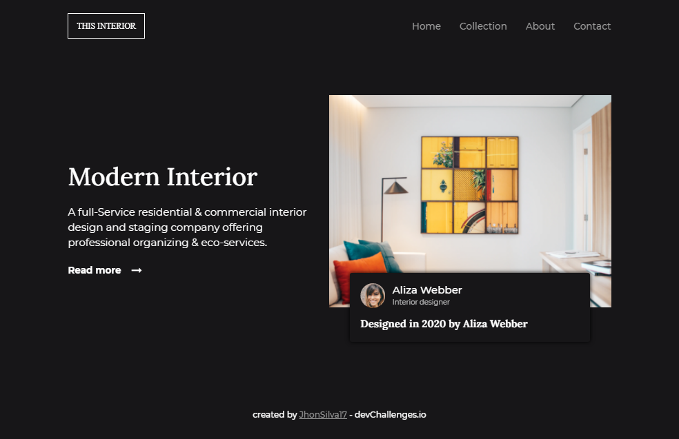

<h1 align="center">Interior Consultant</h1>

Landing page realizada para um empresa de design de interiores. Desafio realizado pela <a href="https://devchallenges.io">devChallenge.io</a>

Veja o resultado ao vivo <a href="https://jhon-interior.netlify.app/">clique aqui!</a>

##  Resultado - Desktop

    

## Resultado - Mobile

    

## Tecnologias utilizadas

Neste projeto, utilizei as seguintes tecnologias:
    - HTML
    - SCSS ou Sass
    - Javascript

## :link: Como contribuir 

- Faça um Fork do repositório
- Clone o seu repositório
- Crie uma branch com a sua feature
- Faça um commit com suas mudanças
- 'Push' a sua branch
- Ir em Pull Requests do projeto original e criar uma pull request com o seu commit

## Portifólio

Visite meu portifólio online em [devjohn.io](https://jhonsilva17.github.io/portfolio-devjohn/)

    