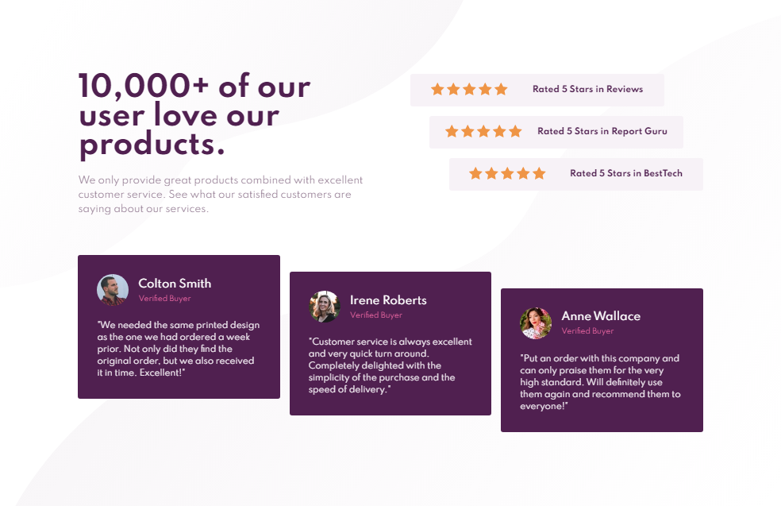

<h1 align="center">Social Section Master</h1>

**Social Section Master** é uma landing page para uma empresa divulgar suas avaliações online. Layout realizado pelo [frontendmentor](https://www.frontendmentor.io/challenges/social-proof-section-6e0qTv_bA/hub/social-proof-section-sk5DoHOYD)

## :rocket: Resultado - Desktop

## :rocket: Resultado - Mobile

## :link: Como contribuir 

- Faça um Fork do repositório
- Clone o seu repositório
- Crie uma branch com a sua feature
- Faça um commit com suas mudanças
- 'Push' a sua branch
- Ir em Pull Requests do projeto original e criar uma pull request com o seu commit

## :link: Visite meu site

[Dev.John](https://jhonsilva17.github.io/portfolio-devjohn/)