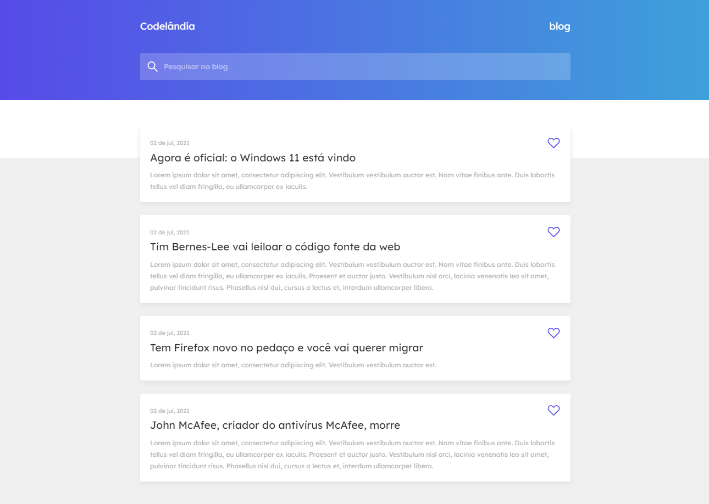
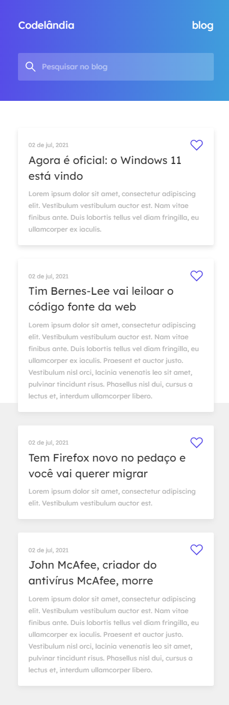

# :rocket: Codelândia

O Codelândia Blog, foi um desafio para treinar habilidades com criação de layouts, usando HTML e CSS.
O desafio foi feito por um servidor no Discord, criado pelo [@IuriCode](https://bio-iuricode.vercel.app)

## Resultado - Desktop

## Resultado - Mobile

## :link: Mais informações

Veja o resultado do projeto: [Codelândia](https://codelandia-devjohn.netlify.app)
