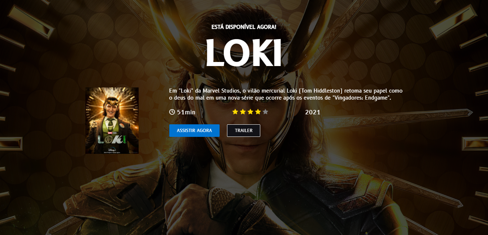

# :rocket: Loki

Esse layout foi desenvolvido para fins acadêmicos, especificamente, para treinar minhas habilidade em HTML e CSS. Layout desenvolvido pelo [@IuriCode](https://bio-iuricode.vercel.app) e eu aceitei o desafio que me foi proposto.

## Resultado - Desktop

## Resultado - Mobile

## :link: Mais informações

Veja o resultado do projeto: [Loki](https://loki-john.netlify.app)
