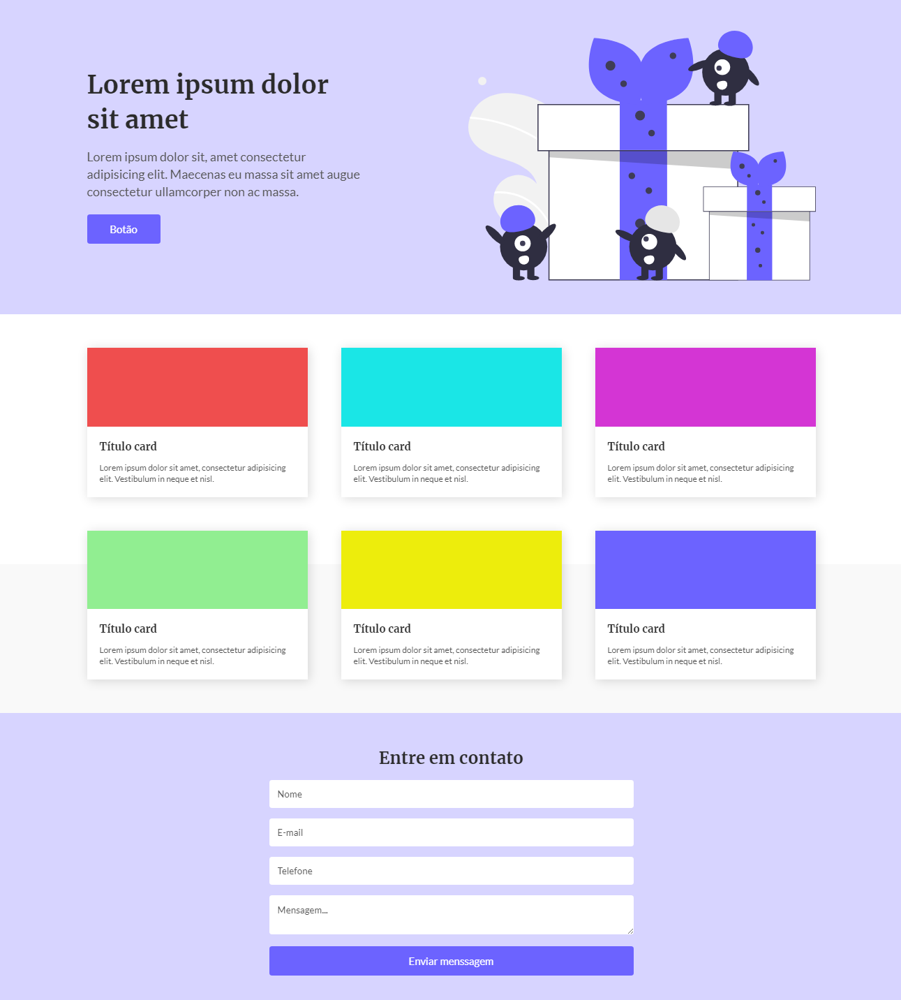
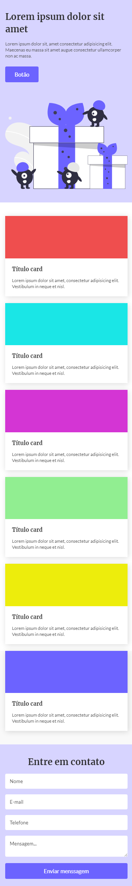

# :rocket: One page

Página one page. Desenvolvida para fins de estudos, onde apliquei
as técnicas de layout com CSS flexbox e resposividade. Desafio realizado pelo [@IuriCode](https://bio-iuricode.vercel.app)

## Resultado - Desktop

## Resultado - Mobile

## :link: Mais informações

Veja o resultado do projeto: [One_page](https://one-page-john.netlify.app/)
