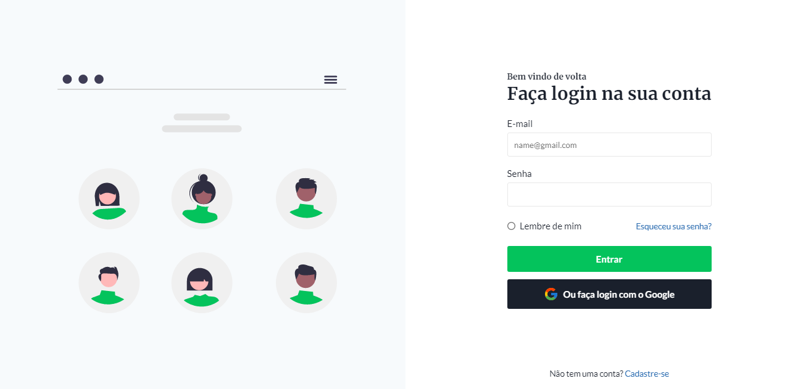
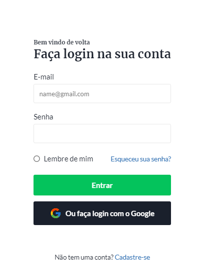

# :rocket: Codelândia

A página de login foi feita através de um desafio para treinar habilidades com criação de layouts e formulários, usando HTML e CSS.
O desafio foi feito por um servidor no Discord, criado pelo [@IuriCode](https://bio-iuricode.vercel.app)

## Resultado - Desktop

## Resultado - Mobile

## :link: Mais informações

Veja o resultado do projeto: [LoginPage](https://pagelogin-john.netlify.app)
