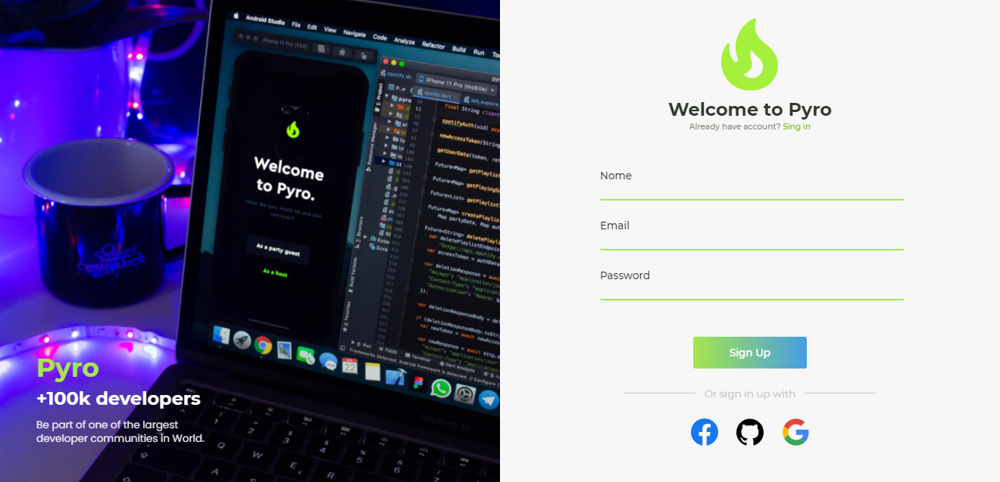
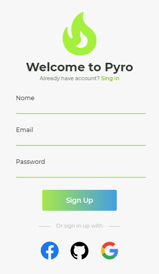

<h1 align="center">Unifeed.</h1>

**Pyro Web** é apenas página de login, onde seu layout foi desenvolvido para fins acadêmicos, onde eu mesmo desenvolvi o design da aplicação utilizando o figma.

Veja o projeto online - [Clique aqui](https://pyro-web.netlify.app)

## :rocket: Resultado - Desktop

## :rocket: Resultado - Mobile

## :link: Como contribuir 

- Faça um Fork do repositório
- Clone o seu repositório
- Crie uma branch com a sua feature
- Faça um commit com suas mudanças
- 'Push' a sua branch
- Ir em Pull Requests do projeto original e criar uma pull request com o seu commit

## :link: Visite meu site

[Meu portifólio - clique aqui](https://jhonsilva17.github.io/portfolio-devjohn/)